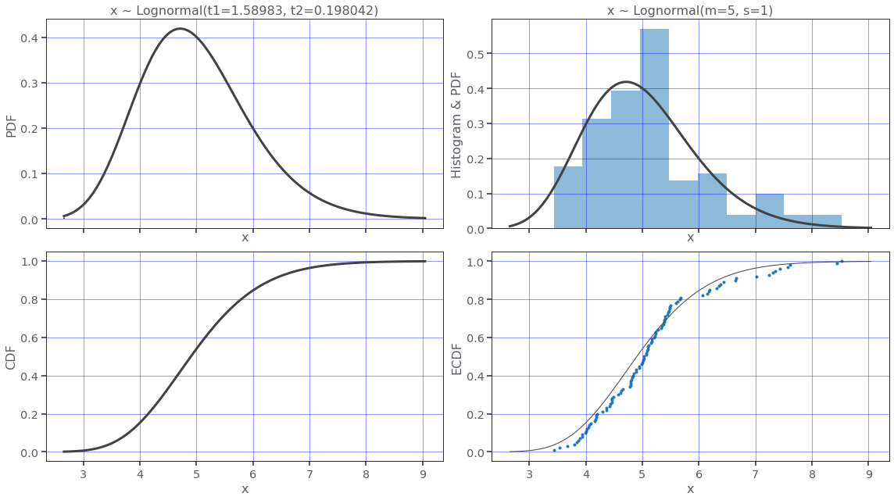
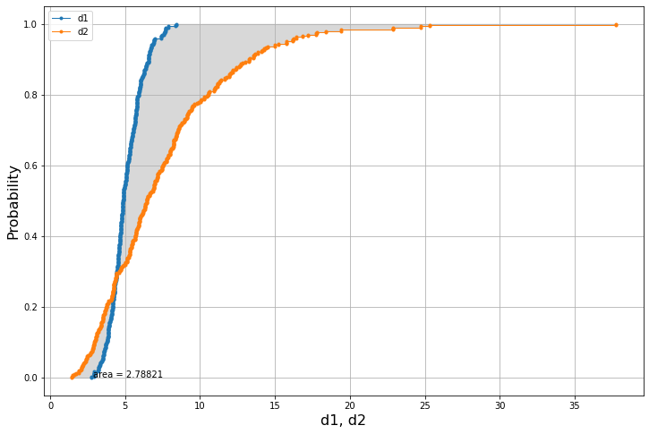
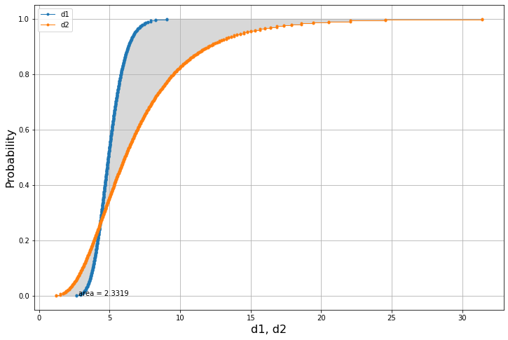

# Area metric code

[](https://zenodo.org/badge/latestdoi/326476924)


This repository gathers code for computing the stochastic area metric, in Python.

To cite this repository use:

> De Angelis M., Sunny J. (2021). *Stochastic area metric*. Github repository. 
> 
> https://github.com/marcodeangelis/Stochastic-area-metric/ 
> 
> doi: https://doi.org/10.5281/zenodo.4419644

or the BibTex:

``` bibtex
@misc{DS2021,
  author = {De Angelis, M., Sunny, J.},
  title = {Stochastic area metric},
  year = {2021},
  publisher = {GitHub},
  journal = {GitHub repository},
  doi = {10.5281/zenodo.4419645},
}
```


For more about the *stochastic area distance* or *Wasserstein distance* the reader is referred to the following references:

[1] Ferson, S. and Oberkampf, W.L., 2009. Validation of imprecise probability models. International Journal of Reliability and Safety, 3(1-3), pp.3-22.

[2] https://en.wikipedia.org/wiki/Wasserstein_metric

[3] https://docs.scipy.org/doc/scipy/reference/generated/scipy.stats.wasserstein_distance.html

*Disclaimer:* This code library has been developed for research, testing, and educational reasons. It is by no means optimized to deal with large datasets. With large datasets we reccommed the use of the `scipy` package. An optimized version of this library is currently under development.

## Get started

Clone the repository using: 
``` bash
$ git clone git@github.com:marcodeangelis/stochastic-area-metric.git
```

On MacOS/Linux:

``` bash
$ python3 -m venv venv 

$ source venv/bin/activate

(venv) $ pip install -r requirements.txt
```

On Windows10:

``` bash
$ python -m venv venv

$ venv\Scripts\activate

(venv) $ pip install -r requirements.txt
```

## Let's import the Python module for the *area metric*


```python
import areametric as am
```

### We can use the dot notation to access:

* The class `Dataset`
* The function `areaMe`
* The function `plot`
* The class `ParametricDataset`

This is all we are going to need to demonstrate the use of the code library in this repository.

# Datasets of the same size
### Let's create two datasets with the same number of elements

Notice:

The datasets need to be created as Python `lists` and not as numpy arrays.


```python
d1 = [1,2,3,4,5,6,7,8]
d2 = [4.5]*8
```

We can already use the code to compute the area metric in just one line:


```python
print(am.areaMe(d1,d2))
```

    2.0


We can then use the `plot` function to visualise the results in a single plot.


```python
am.plot(d1,d2)
```


Let's consider two different datasets.


```python
d1=5*[1.]
d2=5*[5.]
```

We would expect this difference to be equal to `4.0` as these two datasets are equvalent to two points.


```python
am.areaMe(d1,d2)
```


    4.0


The plot confirms this intuition.


```python
am.plot(d1,d2)
```


## The `Dataset` class

We can make use of the `Dataset` class in several ways. One of these is to obtain the same results with some syntactic sugar, so in a more elegant way.


```python
d1,d2 = [1,2,3,4,5,6,7,8],[4.5]*8
D1 = am.Dataset(d1)
D2 = am.Dataset(d2)
```

We can plot the individual datasets:


```python
D1.plot()
```


And we can compute the area metric using the subtraction operator `-`.


```python
D1-D2
```


    2.0


The infix operator `-` that implements the `area-metric` is commutative as we expected because it is in all respects a true metric. So swapping the operands will yield the same answer.


```python
D2-D1
```


    2.0


# Datasets of different size

This category of datasets will come soon.


```python

```
# Parametric datasets

Parametric datasets are datasets obtained from parametric distributional models such as the Lognormal distribution.

Let's define a Lognormal distribution using the moments.


```python
lognormal_dist = am.Lognormal(5,1)
print(lognormal_dist)
```

    x ~ Lognormal(m=5, s=1)


Let's plot this distribution.


```python
lognormal_dist.plot(N=100)
```





Now we can use the `Lognormal` distribution to generate two datasets. 

We will use different mean and standard-deviation for the two datasets.


```python
lognormal_dist_1 = am.Lognormal(5,1)
lognormal_dist_2 = am.Lognormal(7,4)
```

We can now generate the datasets using the method `sample`. 

We will generate a big number of samples to test the speed of the code.


```python
d1 = am.Dataset(list(lognormal_dist_1.sample(N=100_000)))
d2 = am.Dataset(list(lognormal_dist_2.sample(N=100_000)))
```


```python
d1-d2
```


    2.319762595668186


Below we time the execution. It takes a small fraction of a second (0.265 s) to compute the distance between two datasets with 1e5 elements. 


```python
%timeit d1-d2
```

    265 ms ± 3.95 ms per loop (mean ± std. dev. of 7 runs, 1 loop each)


The plot is done using less samples as accuracy is not a priority.


```python
am.plot(list(lognormal_dist_1.sample(N=300)),list(lognormal_dist_2.sample(N=300)))
```





The median difference is:


```python
abs(lognormal_dist_1.median() - lognormal_dist_2.median())
```


    1.1747986164166138


To get better accuracy we can generate the datasets using directly the inverse cumulative distribution, aka *percent point function* `ppf`. In this way we'll get rid of the sampling error, and we'll get an answer that is deterministic and not as sensitive to the cardinality of the dataset.

We'll use the class `ParametricDataset` to generate the data.


```python
x1 = am.ParametricDataset(lognormal_dist_1, N=300)
x2 = am.ParametricDataset(lognormal_dist_2, N=300)
am.plot(x1.to_list(),x2.to_list())
```





```python
x1-x2
```


    2.3319029880776765


We can check that the obtained result coincides exactly with the result using the `scipy` code library, which is a very good news.


```python
from scipy.stats import wasserstein_distance # https://docs.scipy.org/doc/scipy/reference/generated/scipy.stats.wasserstein_distance.html
wasserstein_distance(x1,x2)
```


    2.331902988077677


```python

```
