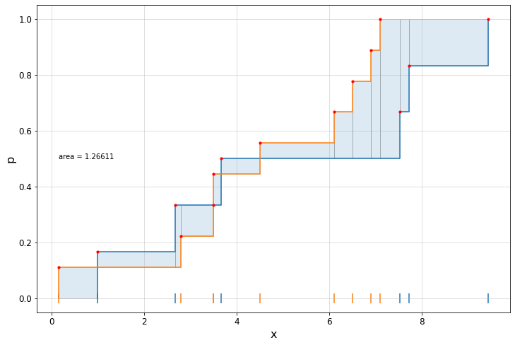
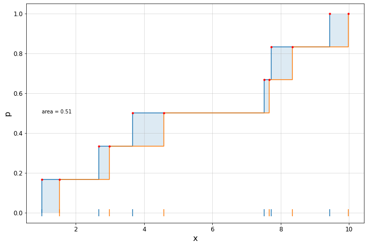
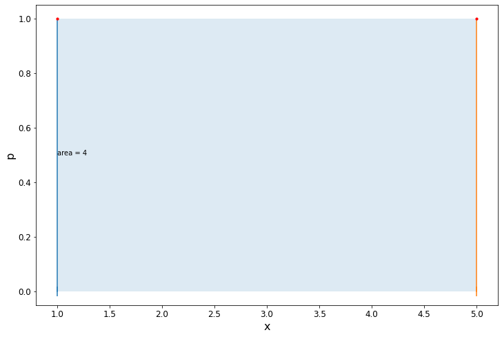
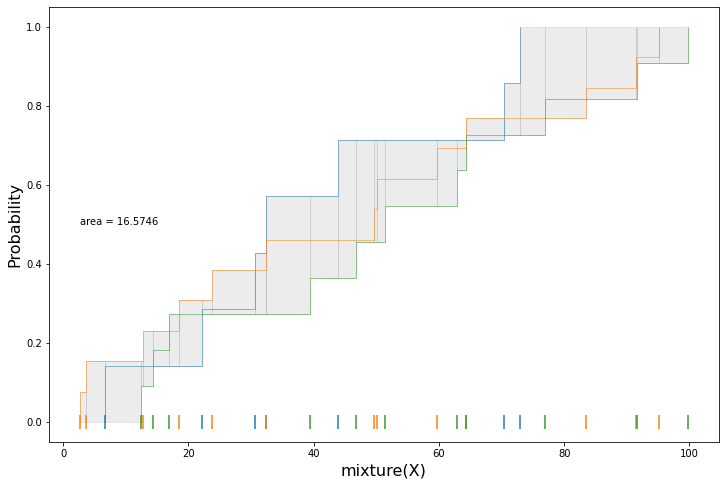
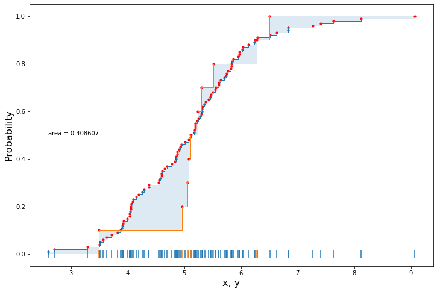

# Welcome!

[](https://zenodo.org/badge/latestdoi/326476924)

[](https://codecov.io/gh/marcodeangelis/Stochastic-area-metric)


*stochastic area metric* is a scientific code library written in Python, for computing efficiently the area metric, a.k.a. 1-Wasserstein distance, between tabular samples. The code is optimized by running Numpy under the hood, thus is as vectorized as possible. 
A basic Matlab version is also present in this repository. 

This is an __open source project__: we welcome contributions to enlarge and improve this code. If you see any error or problem, please open a new issue. If you want to join our team of developers, get in touch!

We especially welcome contributions to extend this code to other scientific languages like R and Julia. 

>*Disclaimer 1:* While this code has been optimized to deal with large data sizes, it is by no means the most efficient implementation. We always look to improve the efficiency of the code taking advantage of the most recent features of vector programming.

>*Disclaimer 2:* The stochastic area metric can be efficiently computed with SciPy using `scipy.stats.wasserstein_distance(x,y)`. So why reinventing the wheel? Our code can compute the area metric between tensors elementwise, i.e. when `x` and `y` have compatible but multiple dimensions. Moreover, we provide code for computing the area metric of a mixture of CDFs, for producing confidence bands, as well as for plotting. 

## Theory

The stochastic area metric is a **metric** in the very sense of the word. Although it is often referred to as *Wasserstein distance* or *Kantorovich-Rubinstein distance*, it is indeed a metric and coincides with the area between the two cumulative distributions or CDFs (see [1] for more). Despite its popularity has recently peaked with the work of Villani et al. on optimal transport, the metric has been around for longer than generally believed. Some say that the very notion of metric came around with Frechet while attempting to establish a distance between probability distributions. 

## Applications in engineering

The stochastic area metric has been recently applied in engineering for model validation [2,3,4], model calibration [5,6], and model ranking [7]. For more about model validation is reader is referred to the DAWS/SANDIA report. See [References](##-References) below.

## Use this code:
* To compute the area between two or multiple 1d cumulative distributions (CDFs) obtained from empirical tabular data. The area metric will be computed elementwise, assuming the first dimension as the *repetitions* dimension.

* To compute the area metric of the envelope of a mixture of cumulative distributions. 

* To plot the area between the cumulative distributions.

* To compute the absolute value of the difference of two random variables `X` and `Y`, that is `|X-Y|` under perfect dependence. 

## Unanswered questions

* Can the absolute value of the difference of two random variables `X` and `Y`, that is `|X-Y|`, be computed under no dependency statement?

## Future extensions
* Extend the 1d area metric to comparing bivariate or even multivariate empirical cumulative distributions.

## Acknowledgements
Thanks to Scott Ferson, Ander Gray, Enrique Miralles-Dolz and Dominic Calleja. 

## Contact
You can reach us at `mda@liverpool.ac.uk`.

## References

[1] de Angelis, M. and Gray, A., 2021. Why the 1-Wasserstein distance is the area between the two marginal CDFs. *arXiv preprint arXiv:2111.03570*. 
https://doi.org/10.48550/arXiv.2111.03570 

[2] Ferson, S. and Oberkampf, W.L., 2009. Validation of imprecise probability models. *International Journal of Reliability and Safety*, 3(1-3), pp.3-22.

[3] Ferson, S., Oberkampf, W.L. and Ginzburg, L., 2008. Model validation and predictive capability for the thermal challenge problem. *Computer Methods in Applied Mechanics and Engineering, 197(29-32)*, pp.2408-2430.

[4] Oberkampf, W.L. and Ferson, S., 2007. *Model Validation Under Both Aleatory and Epistemic Uncertainty* (No. SAND2007-7163C). Sandia National Lab.(SNL-NM), Albuquerque, NM (United States).

[5] Gray, A., Wimbush, A., de Angelis, M., Hristov, P.O., Calleja, D., Miralles-Dolz, E. and Rocchetta, R., 2022. From inference to design: A comprehensive framework for uncertainty quantification in engineering with limited information. *Mechanical Systems and Signal Processing*, 165, p.108210. https://doi.org/10.1016/j.ymssp.2021.108210

[6] Gray, A., Wimbush, A., de Angelis, M., Hristov, P.O., Miralles-Dolz, E., Calleja, D. and Rocchetta, R., 2020. Bayesian calibration and probability bounds analysis solution to the Nasa 2020 UQ challenge on optimization under uncertainty. In *30th European Safety and Reliability Conference, ESREL 2020 and 15th Probabilistic Safety Assessment and Management Conference, PSAM 2020* (pp. 1111-1118). Research Publishing Services.

[7] Sunny, J., de Angelis, M. and Edwards, B., 2022. Ranking and Selection of Earthquake Ground‐Motion Models Using the Stochastic Area Metric. *Seismological Society of America*, 93(2A), pp.787-797. https://doi.org/10.1785/0220210216

[8] https://en.wikipedia.org/wiki/Wasserstein_metric

[9] https://docs.scipy.org/doc/scipy/reference/generated/scipy.stats.wasserstein_distance.html


---

## Cite

> De Angelis M., Sunny J. (2021). *The stochastic area metric*. Github repository. 
> 
> https://github.com/marcodeangelis/stochastic-area-metric/ 
> 
> doi: https://doi.org/10.5281/zenodo.4419644

BibTex:

``` bibtex
@misc{DS2021,
  author = {De Angelis, M., Sunny, J.},
  title = {Stochastic area metric},
  year = {2021},
  publisher = {GitHub},
  journal = {GitHub repository},
  doi = {10.5281/zenodo.4419645},
}
```


# Installation
First, download or clone this repository on your local machine.

If you don't have Github ssh keys (you may have to enter your github password) use:

`git clone  https://github.com/marcodeangelis/stochastic-area-metric.git`

Otherwise:

`git clone git@github.com:marcodeangelis/stochastic-area-metric.git`


> If you don't have a Github account, just click on the code green button  at the top of this page and hit Download. This will zip and download the code in your designated downloads folder.


Then, open a code editor in the cloned or unzipped downloaded folder. 

## Integration 

To use this code in your Python project, just copy the folder `areametric` in your workspace. In fact, all the (Python) code is contained in this folder; look no further! Once the `areametric` is in your workspace, it will be seen as a Python package, so you can simply import the code using: 

```python
import areametric as am
```

and use the dot notation to access the name space. See more about this at the [import code](##-Importing-the-code) section.

## Dependencies

Only Numpy is a mandatory dependency. So the `requirements.txt` has the following single line:

```
numpy>=1.22
```

We recommend installing also `matplotlib` for plotting. 

### Virtual environment

Set up your Python3 virtual environment to safely install the dependencies.

```bash
$ python3 -m venv myenv 

$ source myenv/bin/activate 

# On Windows replace the second line with: 

#$ myenv\Scripts\activate

(myenv) $ pip install -r requirements.txt
```


# Stochastic area metric

Let's see the code in action. 


## Importing the code

There are two recommended ways to import the code. 

(1) Make use of the default importer, which can be invoked as follows:

```python
import areametric as am
```


(2) Explicitly import the needed classes and functions: 


```python
from areametric.areametric import (areaMe)
from areametric.dataseries import (dataseries,mixture) 
from areametric.methods import (ecdf, quantile_function, inverse_quantile_function)
from areametric.plotting import (plot_area, plot_ecdf)
```

In what follows we'll be using the importer as in (1).

## Basic use

Let `x` and `y` be two vectors containing some samples:

```python
x = [1.  , 2.68, 7.52, 7.73, 9.44, 3.66]
y = [3.5 , 6.9 , 6.1 , 2.8 , 3.5 , 6.5 , 0.15, 4.5 , 7.1 ]
```

The area metric between `x` and `y` is:

```python
print(am.areaMe(x,y))
# 1.266111111111111
```

We can plot the results using:

```python
am.plot_area(x,y,areame=True,grid=True)
```


We can also output the individual chunks of area in each pocket between the two ECDFs as follows:

```python
print(am.area_chunks(x,y))
# array([0.09444444, 0.09333333, 0.02666667, 0.07777778, 0.        ,
#        0.01777778, 0.04666667, 0.08888889, 0.06666667, 0.11111111,
#        0.07777778, 0.21      , 0.07      , 0.285     ])
```

When the two samples have the same size, the code is fastest. For example, 

```python
x = [1.  , 2.68, 7.52, 7.73, 9.44, 3.66]
y = [1.52, 2.98, 7.67, 8.35, 9.99, 4.58]
```

The area metric between their empirical CDFs is: 

```python
print(am.areaMe(x,y))
# 0.51
am.plot_area(x[0],x[1],areame=True,grid=True)
```



For speed comparisons see the speed test section below.

One neat aspect of the area metric is that when it is computed between two samples of size one, it coincides with their absolute-value difference. So for example, 

```python
x = [1.]
y = [5.]

print(am.areaMe(x,y))
# 4.0

am.plot_area(x,y)
```




The value of the area metric can be visually checked in this simple example:

```python

x = [1,2,3,4,5,6,7,8]
y = [4.5]

am.plot_area(x,y)

```


# Tabular data

Data is often tabular that is, each sample or repetition has a dimension greater than one.  For example, each sample can be a vector, a matrix, or a Nd-array. In this section, we show how the area metric can be computed between such data structures.


Let's say that we have collected `12` samples by repeating the experiment `12` times, and that each sample has dimension `5`. This can be simulated as follows: 


```python
import numpy as np

X = np.round(np.random.random_sample(size=(12,5))*10000)/100
print(X)

X = [[35.85, 26.73, 63.47, 14.58, 15.35],
     [34.84, 48.21, 90.14, 79.91, 61.55],
     [47.1,  58.52, 80.02, 89.55, 98.37],
     [87.29, 57.57, 98.42, 41.13,  9.08],
     [31.02, 19.95,  6.23, 88.4,  33.04],
     [72.35, 80.74, 78.81, 95.42, 71.22],
     [48.27, 90.7,   9.66, 29.04, 35.63],
     [92.54, 70.71, 90.9,  22.44, 30.58],
     [82.46, 55.07, 99.85, 93.94, 25.07],
     [39.29, 21.26, 74.35, 86.14, 82.07],
     [69.06, 71.84, 56.92, 73.94, 98.34],
     [17.86, 30.81,  1.18, 20.74, 57.51]]

```

where each row is a repetition. In this case, we have `5` empirical CDFs, one per column.
 
After some time, we run the experiment again but this time we were able to collect `24` samples: 

```python
import numpy as np

Y = np.round(np.random.random_sample(size=(24,5))*10000)/100
print(Y)

Y = [[89.19, 11.06, 67.77, 74.63, 82.85],
     [80.11, 72.08, 63.6 , 59.23, 18.11],
     [72.08, 89.95, 88.91, 24.99, 21.31],
     [38.48, 51.31, 40.5 , 85.23,  4.98],
     [90.96, 11.49, 58.6 , 72.48, 34.11],
     [40.16, 88.51, 74.24, 92.48, 63.66],
     [83.81, 28.17, 98.57, 67.76,  5.9 ],
     [78.62, 26.92, 38.36, 14.63, 73.33],
     [44.3 , 32.97,  6.71,  3.17, 61.81],
     [22.38, 50.16, 70.09, 51.27, 22.  ],
     [81.87, 45.66, 36.64, 36.08, 91.76],
     [78.39, 50.15, 11.95, 23.67,  2.84],
     [11.75, 48.47, 84.58, 91.02, 62.6 ],
     [78.68,  8.24, 37.94, 88.91, 21.62],
     [53.69, 89.26, 79.13,  1.91,  8.86],
     [89.88, 67.02, 46.64, 15.49, 67.84],
     [26.91, 87.2 , 94.37, 80.58,  8.17],
     [44.74, 47.86, 38.99, 68.11, 41.09],
     [26.01, 37.01, 82.22, 59.35, 11.73],
     [39.35, 28.36, 88.42, 34.88, 82.69],
     [16.41, 74.31, 42.09, 85.61, 13.67],
     [87.77, 96.49, 33.3 , 85.3 , 55.66],
     [66.76, 84.61, 49.56, 76.56, 11.35],
     [ 0.57, 23.86, 74.69, 72.04, 94.15]]
```

At this point we want to compare these two samples `X` and `Y` and see if there has been any appreciable change. We can compute the area metric right away:

```python
print(am.areaMe(X,Y))
# [ 7.00875  6.385   14.73125  8.12    11.41875]

```

which will output an `ndarray` with the area metric between the two samples for each of the `5` dimensions. 

This was possible because `X` and `Y` are both compatible *tabular* data series, i.e. they are samples with the same dimension. We can use the parser `dataseries` to analyse these two samples: 


```python

X_ds = am.dataseries(X)
print(X_ds.info)
# {'class': 'DataSeries', 'rep': 12, 'dim': (5,), 'tabular': True}

Y_ds = am.dataseries(Y)
print(Y_ds.info)
# {'class': 'DataSeries', 'rep': 24, 'dim': (5,), 'tabular': True}
```

We can also compute the area metric between samples whose dimension has cardinality greater than 1. For example, each sample in the data can be a matrix of dimension 3x2 (cardinality 2):

```python
X = np.round(np.random.random_sample(size=(7,3,2))*10000)/100
X= [[[73.02, 73.77],
     [ 5.9,  51.31],
     [34.37, 48.87]],

     [[ 6.63, 54.87],
      [83.52, 50.12],
      [53.08, 35.13]],

     [[22.11,  3.55],
      [53.16, 70.89],
      [ 2.31, 75.97]],

     [[30.58, 47.31],
      [81.03, 50.84],
      [10.03, 46.05]],

     [[43.92, 34.72],
      [71.6,  95.53],
      [50.46, 29.36]],

     [[70.44, 74.75],
      [49.18, 14.76],
      [ 2.73, 90.03]],

     [[32.36, 53.21],
      [94.28, 77.12],
      [80.05, 57.57]]]
Y = np.round(np.random.random_sample(size=(13,3,2))*10000)/100
Y = [[[23.74, 31.6 ],
      [31.77, 38.67],
      [84.94, 92.09]],

     [[95.07, 10.69],
      [ 4.6,  79.76],
      [74.1,  99.41]],

     [[83.42, 11.59],
      [ 4.33, 62.08],
      [22.66,  6.08]],

     [[32.36, 20.77],
      [ 4.84,  4.92],
      [21.93, 48.47]],

     [[18.48, 22.85],
      [22.14, 41.66],
      [26.77, 45.18]],

     [[91.4,  70.19],
      [93.46, 81.74],
      [65.76, 16.86]],

     [[ 2.63, 13.47],
      [24.86, 53.08],
      [42.92, 37.97]],

     [[64.34, 77.73],
      [91.83,  6.93],
      [61.,   85.52]],

     [[50.1,  99.75],
      [ 4.48, 21.14],
      [99.14, 32.01]],

     [[12.82, 31.2 ],
      [40.9,  64.32],
      [72.7,  29.02]],

     [[59.7,  80.4 ],
      [67.14, 69.97],
      [97.93, 92.76]],

     [[ 3.66, 23.48],
      [40.34, 80.26],
      [14.93, 13.72]],

     [[49.7,  35.82],
      [35.81, 22.44],
      [84.37, 48.69]]]

X_ds = am.dataseries(X)
print(X_ds.info)
# {'class': 'DataSeries', 'rep': 7, 'dim': (3, 2), 'tabular': True}

Y_ds = am.dataseries(Y)
print(Y_ds.info)
# {'class': 'DataSeries', 'rep': 13, 'dim': (3, 2), 'tabular': True}
```

The area metric between these two tabular data series will be a matrix of area-metric values of dimension 3x2:

```python
print(am.areaMe(X,Y))

# [[10.8156044  16.32725275]
#  [26.96516484 11.88197802]
#  [25.87538462 11.81230769]]
```

In summary, when samples are tabular, the area metric will assign the first dimension to a *repetitions* dimension. For example, an array of shape `(13,3,2)` like the one above for `Z`, will be seen as a tabular data set with `13` repetitions and dimension `(3,2)`.

<!-- Given two datasets `x` and `y` the universal parser `dataseries` will cast an array-like numeric data structure into an object called `DataSeries` that the library uses. The parser `dataseries` will make sure that `x` is of numeric type and can be seen as a sample. The first dimension of the array-like structure `x` will be interpreted as the 'repetitions' dimension; the remaining dimensions will constitute the dimension of the sample. -->

# Data mixtures
A data mixture is a collection of compatible data series (same dimension) but carrying different lengths. For example, `X` and `Y` in any of the previous examples are two compatible data series with a different number of repetitions. In the last example:

```python
len(X_ds)
# 7
len(Y_ds)
# 13
```

So `X` and `Y` together constitute a *mixtures* of tabular data. 

With mixtures, the computation of the area metric is not confined to a binary operation, i.e. an operation between two data series. In fact, we can introduce a third data set: 

```python
Z = np.round(np.random.random_sample(size=(11,3,2))*10000)/100

Z_ds = am.dataseries(Z)
print(Z_ds.info)
# {'class': 'DataSeries', 'rep': 11, 'dim': (3, 2), 'tabular': True}

print(Z)

Z = [[[14.38, 17.08],
      [15.73, 22.87],
      [67.04, 95.6 ]],

     [[46.8 , 24.32],
      [84.98, 34.08],
      [95.26, 99.87]],

     [[99.8,  25.26],
      [45.59, 46.32],
      [19.28,  7.  ]],

     [[91.7,  51.62],
      [47.2,  31.38],
      [56.28, 95.3 ]],

     [[64.4,  66.47],
      [51.89, 51.38],
      [44.3 , 61.  ]],

     [[76.95,  0.2 ],
      [58.39, 64.42],
      [30.84, 96.29]],

     [[12.51, 43.74],
      [52.34,  7.71],
      [37.04, 71.07]],

     [[39.4,  26.06],
      [19.03, 70.33],
      [71.79, 15.9 ]],

     [[16.92, 18.4 ],
      [14.46, 85.53],
      [71.17, 20.54]],

     [[51.32, 30.  ],
      [17.71, 24.29],
      [59.89, 83.54]],

     [[62.87, 33.72],
      [84.1,  23.63],
      [46.23,  4.78]]]

```


and then create a mixture collecting `X`, `Y` and `Z` in a single instance as follows.

```python
XYZ_m = am.mixture((X,Y,Z))
print(XYZ_m.info)
# {'class': 'Mixture', 'rep': [7, 13, 11], 'dim': (3, 2), 'len': 3, 'hom': False}
```

The resulting mixture will have length 3, as the number of data sets contained in it, and have dimension 3x2. The attribute `hom` that stands for *homogeneous*, will display `True` when the mixture has samples with the same number of repetitions, which is not the case here. A homogeneous data mixture can be dealt with more efficiently, as it can be stored into an `ndarray` and handles as such. 

Calling the area metric function on a mixture will compute the area between the envelope of CDFs that the mixture induces. So, for example, the area metric of the envelope `XYZ_m` is computed as follows:

```python
print(am.areame_mixture(XYZ_m))

# [[16.57455544 24.13756244]
#  [30.0221978  19.68728272]
#  [29.32307692 23.68461538]]
```

We can plot the area metric corrisponding to the location `[0,0]` as follows:


```python
XYZ_m_00 = am.mixture_given_dimension_index(XYZ_m,(0,0))
_=am.plot_mixture_area(XYZ_m_00,grid=False)
```




# Parametric (simulated) data

Parametric data is data obtained sampling at random from a parametric probability distribution such as the lognormal distribution.


For example, let us define a lognormal distribution in terms of first and second moment. We will use the library `scipy.stats` to perform this task. 

```python
import scipy.stats as stats

lognormal = stats.lognorm
```

Because the lognormal is defined in terms of the mean `mu` and variance `s**2` of the random variable `Y` whose exponential is our target distribution `X`, such that `X=exp(Y)`, we are going to need to map these two parameters from the mean and variance of our target lognormal variable. 

```python
import numpy as np

m = 5 # mean of the lognormal distribution X
s = 1 # standard deviation of the lognormal X

r2 = (s/m)**2
mu = m / np.sqrt(1+r2) # mean of Y ~ N
sigma = np.sqrt(np.log(1+r2)) # mean of Y ~ N
# Y ~ N(mu, sigma^2)
```

Our lognormal distribution is:

```python
LN = lognormal(scale=mu, s=sigma)

LN.mean()
# 5.0

LN.std()
# 1.0
```

We can now plot the distribution:


```python
plot_dist(LN, n=100)
```


Now we can use our `lognormal` to generate two data sets,

```python
x = LN.rvs(size=100)
y = LN.rvs(size=10)
```

and plot the area metric between the two:

```python
_=am.plot_area(x,y,plot_box_edges=False)
```




Let us now compute and plot the area metric between two different lognormal distributions.

```python
def map_mom_to_par(m,s): return {'scale':m / np.sqrt(1+(s/m)**2), 's':np.sqrt(np.log(1+(s/m)**2))}
x = stats.lognorm(**map_mom_to_par(5,1)).rvs(size=100)
y = stats.lognorm(**map_mom_to_par(7,4)).rvs(size=100)

_=am.plot_area(x,y,plot_box_edges=False,xtext=0,dots_size=0.1)
```


Now we compute the area metric with a large number of samples, and time the result in a Jupyter notebook.

```python
x = stats.lognorm(**map_mom_to_par(5,1)).rvs(size=100_000)
y = stats.lognorm(**map_mom_to_par(7,4)).rvs(size=100_000)

am.areaMe(x,y)

# 2.306821838658021
```


```python
%timeit am.areaMe(x,y)
```
> 34.1 ms ± 1.37 ms per loop (mean ± std. dev. of 7 runs, 10 loops each)

<!-- The plot is done using less samples as accuracy is not a priority.


```python
am.plot(list(lognormal_dist_1.sample(N=300)),list(lognormal_dist_2.sample(N=300)))
```


The median difference is:


```python
abs(lognormal_dist_1.median() - lognormal_dist_2.median())

#    1.1747986164166138
```


To get better accuracy we can generate the datasets using directly the inverse cumulative distribution, aka *percent point function* `ppf`. In this way we'll get rid of the sampling error, and we'll get an answer that is deterministic and not as sensitive to the cardinality of the dataset.

We'll use the class `ParametricDataset` to generate the data.


```python
x1 = am.ParametricDataset(lognormal_dist_1, N=300)
x2 = am.ParametricDataset(lognormal_dist_2, N=300)
am.plot(x1.to_list(),x2.to_list())
```


```python
x1-x2

# 2.3319029880776765
``` -->


We can also check that the obtained result coincides exactly with the result obtained using `scipy`'s Wasserstein distance.


```python
from scipy.stats import wasserstein_distance # https://docs.scipy.org/doc/scipy/reference/generated/scipy.stats.wasserstein_distance.html
wasserstein_distance(x,y)

# 2.3068218386580055
```

The `scipy` code is limited to data sets of dimension 1. So if we try to compute the Wasserstein distance between `X` and `Y` from the [tabular data](##tabular-data) section, the following error will be thrown:

```python 
wasserstein_distance(X,Y)
```
>---------------------------------------------------------------------------
>ValueError                                Traceback (most recent call last)
<ipython-input-6-367f0545cc14> in <module>
----> 1 wasserstein_distance(X,Y)

> ValueError: object too deep for desired array


# Bounded area metric
Sometime the analysis requires the imposition of bounds to the computation of the area metric. For example, we may want to compute the metric up to a certain control value or compute the metric only for positive or negative values for two given variables that straddle zero. 


# Speed tests
## Test speed difference between same-size and different-size data sets.

Let's consider the lognormal data seen at section [# Parametric data](#-Parametric-(simulated)-data). 

```python
x = stats.lognorm(**map_mom_to_par(5,1)).rvs(size=10_000)
y = stats.lognorm(**map_mom_to_par(7,4)).rvs(size=10_000)
y_1 = stats.lognorm(**map_mom_to_par(7,4)).rvs(size=10_001)
```

```python 
%timeit am.areaMe(x,y)
```
> 3.01 ms ± 19.5 µs per loop (mean ± std. dev. of 7 runs, 100 loops each)

```python 
%timeit stats.wasserstein_distance(x,y)
```
> 3.04 ms ± 40.3 µs per loop (mean ± std. dev. of 7 runs, 100 loops each)

```python
%timeit am.areaMe(x,y_1)
```

>18.6 s ± 1.94 s per loop (mean ± std. dev. of 7 runs, 1 loop each)

```python
%timeit stats.wasserstein_distance(x,y_1)
```
> 3.16 ms ± 160 µs per loop (mean ± std. dev. of 7 runs, 100 loops each)

With data sizes that are a multiple of one another.

```python
x = stats.lognorm(**map_mom_to_par(5,1)).rvs(size=10_000)
y_1 = stats.lognorm(**map_mom_to_par(7,4)).rvs(size=100_000)
```

The speed difference between `areametric` and `scipy` is quite significant. More profiling of the `aremetric` code is needed to identify the issue. 

```python
%timeit am.areaMe(x,y_1)
```
>28.9 ms ± 1.1 ms per loop (mean ± std. dev. of 7 runs, 10 loops each)

```python
%timeit stats.wasserstein_distance(x,y_1)
```
>21.6 ms ± 1.01 ms per loop (mean ± std. dev. of 7 runs, 10 loops each)


## Test speed with increasing size of the data set.


## Test speed difference against scipy for tabular and non-tabular data.

```python
x = stats.lognorm(**map_mom_to_par(5,1)).rvs(size=100_000)
y = stats.lognorm(**map_mom_to_par(7,4)).rvs(size=100_000)
```

```python 
%timeit am.areaMe(x,y)
```
> 34.7 ms ± 1.3 ms per loop (mean ± std. dev. of 7 runs, 10 loops each)

```python
%timeit stats.wasserstein_distance(x,y)
```

>44.8 ms ± 3.21 ms per loop (mean ± std. dev. of 7 runs, 10 loops each)

For tabular data `scipy` is performs better in both same-size and different-size data. This is understandable, considering the infrastructure behind the `areametric` code. 

For same-size data:

```python
import time 
dim=(3,5)
X = am.example_random_Nd(n=176,dim=dim)
Y = am.example_random_Nd(n=176,dim=dim)

t0=time.time()
am.areaMe(X,Y)
t1=time.time()

print(t1-t0)
# 0.007700920104980469


t0=time.time()
J=am.map_index_flat_to_array(dim)
A=np.empty(dim)
for i in range(np.prod(dim)):
    j,k = J[i]
    x, y = X[:,j,k], Y[:,j,k]
    A[j,k] = stats.wasserstein_distance(x,y)
t1=time.time()

print(t1-t0)
# 0.0023310184478759766
```

And, for different-size data:

```python
import time 
dim=(3,5)
X = am.example_random_Nd(n=81,dim=dim)
Y = am.example_random_Nd(n=79,dim=dim)

t0=time.time()
am.areaMe(X,Y)
t1=time.time()

print(t1-t0)
# 0.01627206802368164

t0=time.time()
J=am.map_index_flat_to_array(dim)
A=np.empty(dim)
for i in range(np.prod(dim)):
    j,k = J[i]
    x, y = X[:,j,k], Y[:,j,k]
    A[j,k] = stats.wasserstein_distance(x,y)
t1=time.time()

print(t1-t0)
# 0.0022368431091308594
```

## Test speed difference between binary and envelope area metric.

The speed difference between binary and envelope area metric can be tested with a mixture dominated by two CDFs. We can generate such mixtures using Dempster-Shafer theory, (1) seeing the target mixture as a collection of fully ordered intervals; (2) and then produce at random one sample for each interval in the Dempster-Shafer structure. The resulting CDFs will all be contained in the mixture. 
