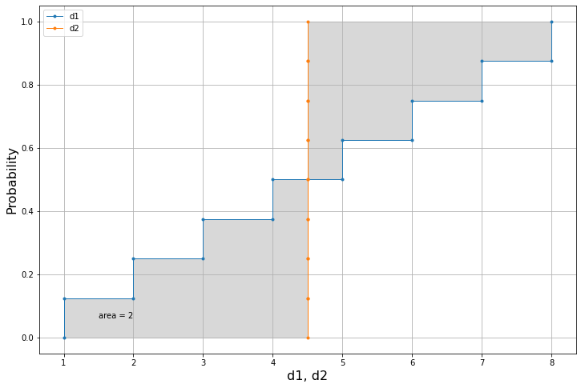

# Introduction


## Let's import the *area metric* module


```python
import areametric as am
```

 Datasets of the same size
### Datasets with the same number of elements

```python
d1 = [1,2,3,4,5,6,7,8]
d2 = [4.5]*8
```

Use the code to compute the area metric in just one line:


```python
print(am.areaMe(d1,d2))
# 2.0
```


Use the `plot` function to visualise the results in a single plot.


```python
am.plot(d1,d2)
```


