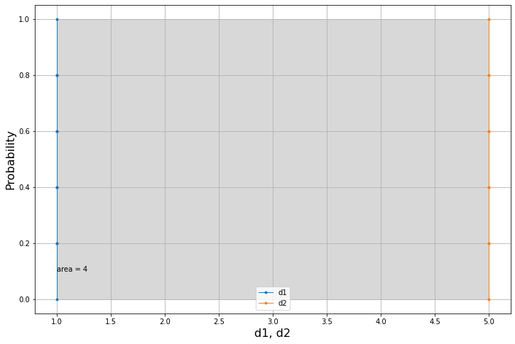

## Let's import the Python module for the *area metric*


```python
import areametric as am
```

### We can use the dot notation to access the following:

* The class `Dataset`
* The function `areaMe`
* The function `plot`

This is all we are going to need to demonstrate the use of the code library in this repository.

# Datasets of the same size
### Let's create two datasets with the same number of elements

Notice:

The datasets needs to be created as Python `lists` and not as numpy arrays.


```python
d1 = [1,2,3,4,5,6,7,8]
d2 = [4.5]*8
```

We can already use our code to compute the area metric with the following line of code:


```python
print(am.areaMe(d1,d2))
```

    2.0


We can then use the `plot` function to visualise the results in a single plot.


```python
am.plot(d1,d2)
```


Let's consider two different datasets.


```python
d1=5*[1.]
d2=5*[5.]
```

We would expect this difference to be equal to `4.0` as these two datasets are equvalent to two points.


```python
am.areaMe(d1,d2)
```


    4.0


The plot will confirm this intuition.


```python
am.plot(d1,d2)
```





## The `Dataset` class

We can make use of the `Dataset` class in several ways. One of these is to obtain the same results with some syntactic sugar, so in a more elegant way.


```python
d1,d2 = [1,2,3,4,5,6,7,8],[4.5]*8
D1 = am.Dataset(d1)
D2 = am.Dataset(d2)
```

We can plot the individual datasets:


```python
D1.plot()
```


And we can compute the area metric using the subtraction operator `-`.


```python
D1-D2
```


    2.0


The area metric operator is commutative because it's a metric. So swapping the operands will yield the same answer.


```python
D2-D1
```


    2.0


# Datasets of different size

This category of datasets will come soon.


```python

```
